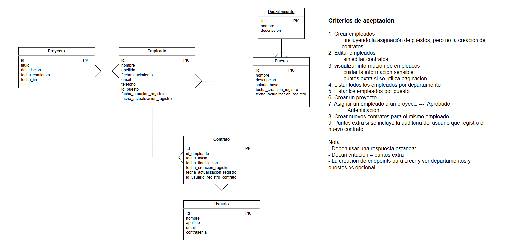

# Human Resources API

Proyecto APIREST desarrollado en Spring Boot.

El proyecto desarrollado esta basado en la siguiente descripcion:

  

## Herramientas de desarrollo

- IDE que se utilizo para el desarrollo del APIREST fue **[IntelliJ Idea]**
- El lenguaje de programación utilizado fue **[Java]**
- El framework utilizado fue **[Spring Boot]**
- La base de datos utilizada fue **[PostgreSQL]**
- La base de datos se alamaceno en **[Neon Serverless Postgres]**
- Herramienta para la prueba de endpoints fue **[Postman]**

[IntelliJ Idea]: https://www.jetbrains.com/idea/download/?section=windows
[Spring Boot]: https://spring.io/projects/spring-boot
[Java]: https://www.java.com/es/
[PostgreSQL]: https://www.postgresql.org/
[Neon Serverless Postgres]: https://neon.tech/home
[Postman]: https://www.postman.com/

## Como usar

1. Descargar el repositorio
2. Abrir el proyecto con intelliJ
3. Las dependencias son instaladas automaticamente
4. Correr el proyecto con el boton (`Run`) en la parte superior derecha o presionar (`Shift+F10`)
5. Acceder a la interfaz de Swagger mediante la ruta: (`http://localhost:8080/swagger-ui/index.html#/`)
6. Realizar las operaciones CRUD en la base de datos mediante la interfaz de Swagger o el uso de Postman en la ruta (`http://localhost:8080/api`)
7. Para realizar la prueba de los endpoints se puede utilizar cualquier otra herramienta de pruebas de API.
8. Todos los endpoints habilitados estan explicados en Swagger
